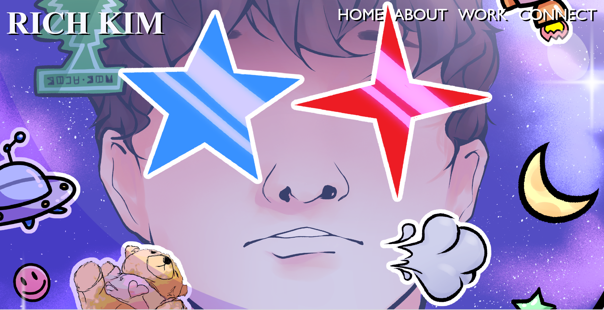
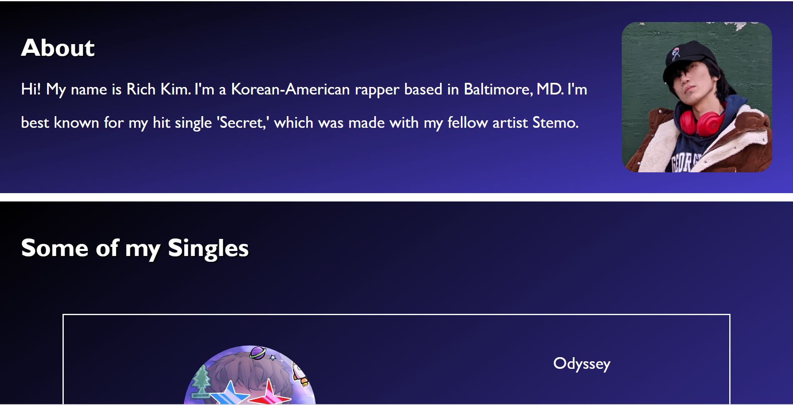
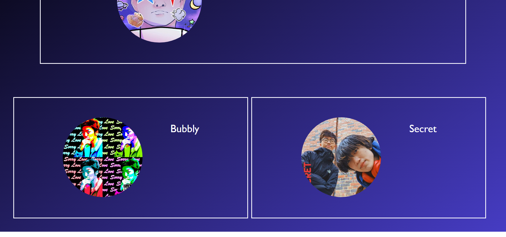
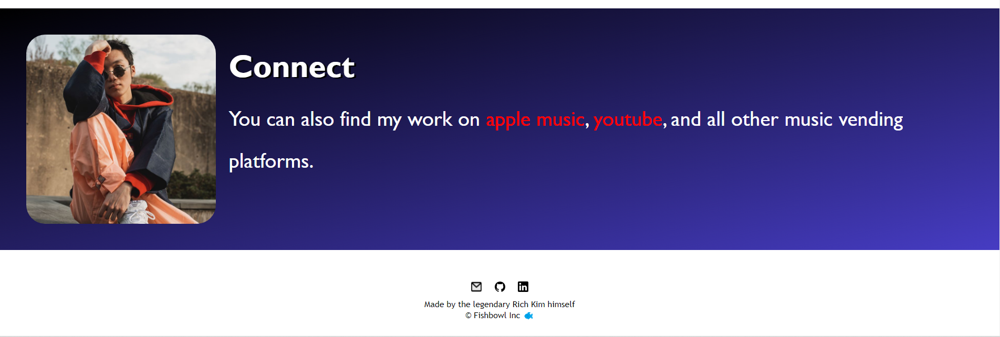

# Richard Kim HW2-Porfolio-Assignment
This assignment is meant to showcase to employers my portfolio

## Table of Contents
1. [Webpage Link](#webpage-link)
2. [Visual](#visual)
3. [Contributors](#contributors)

## Webpage Link
[The webpage](https://rich-afk.github.io/HW2-Porfolio-Assignment/)

## Visual

## Contributors
I heavily borrowed code from the UNCC bootcamp assignments and excersizes, as well as different button and page layout designs from youtube. I'd like to thank baron Skidmore for helping me clean up the formatting of my code.